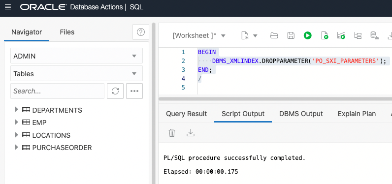
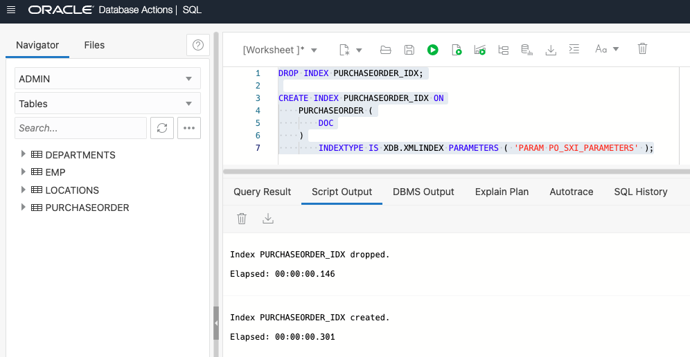
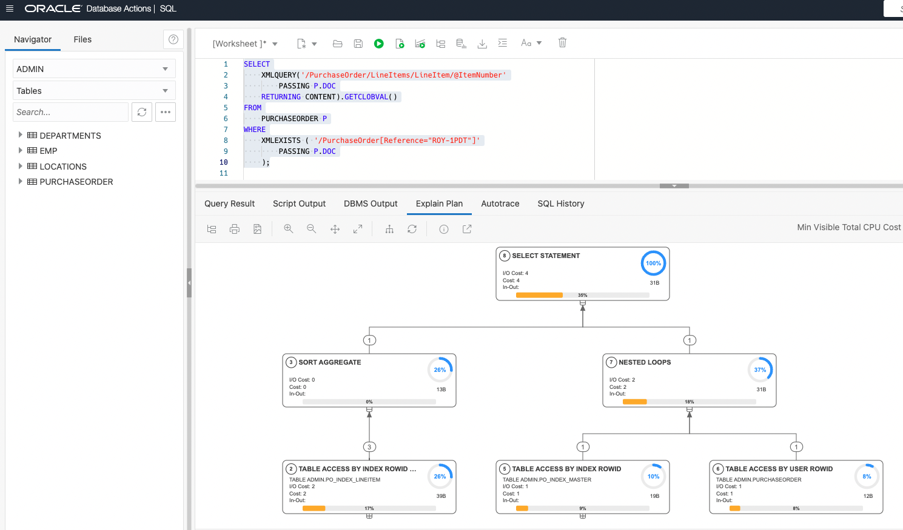
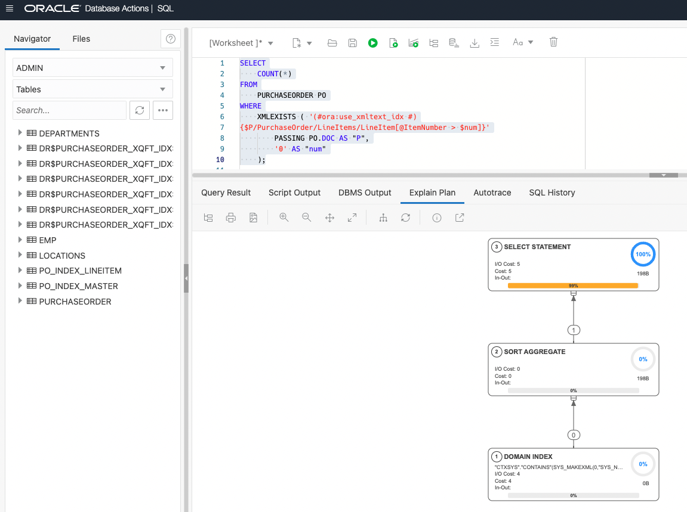
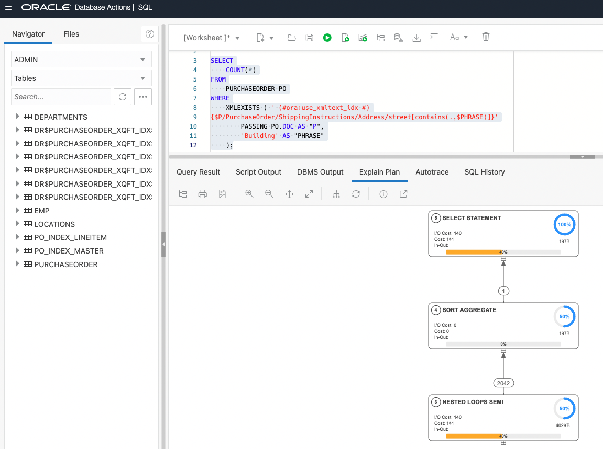
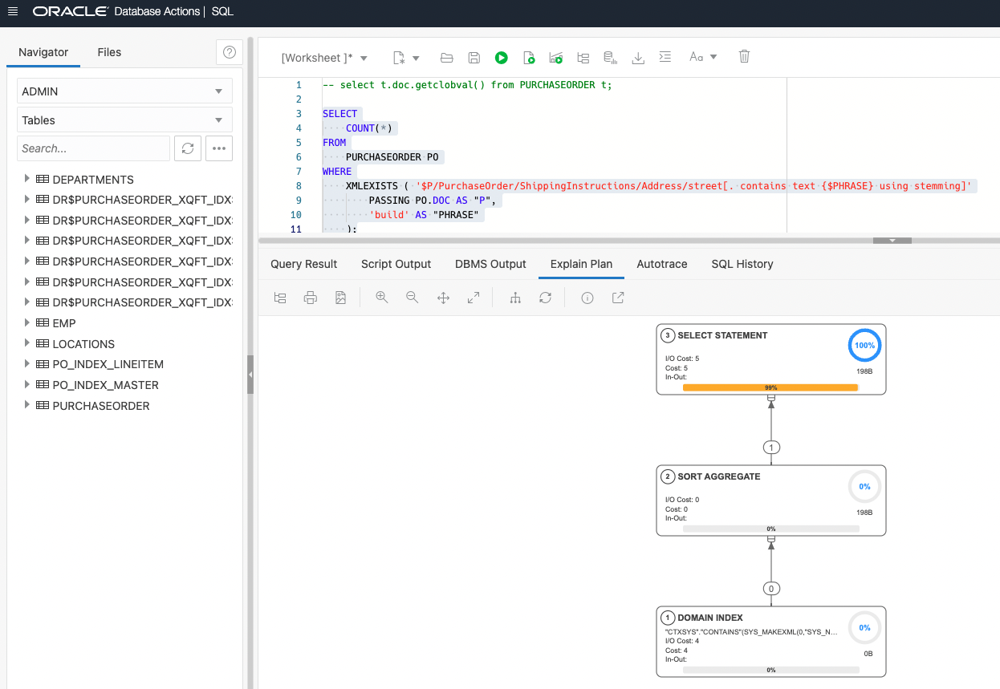
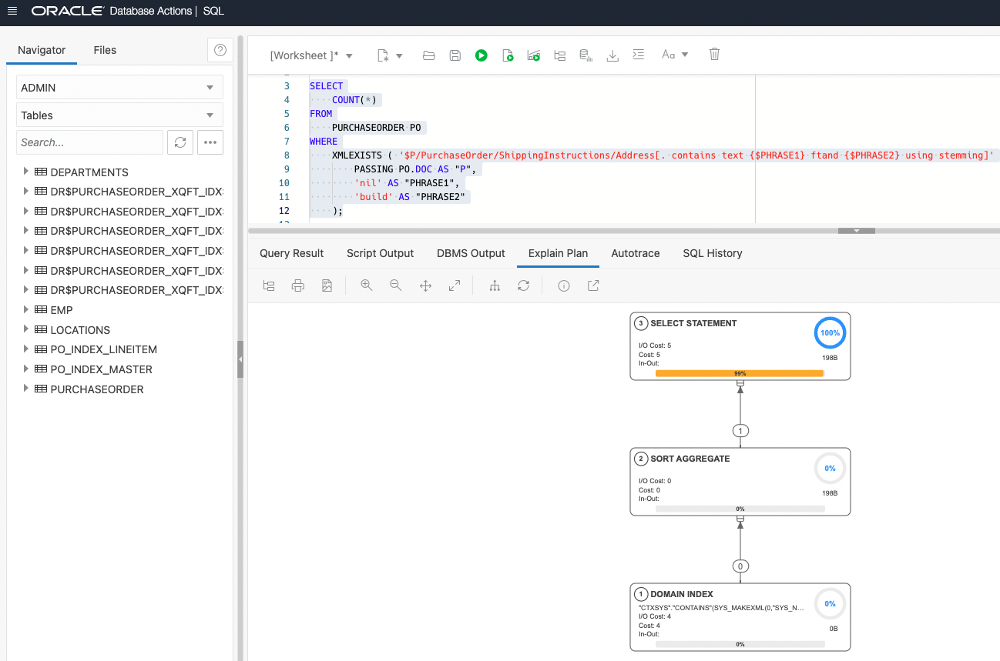
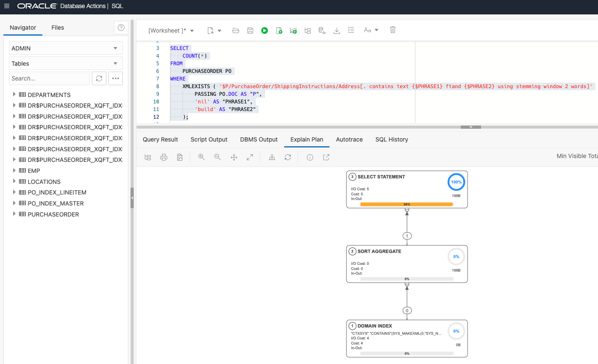
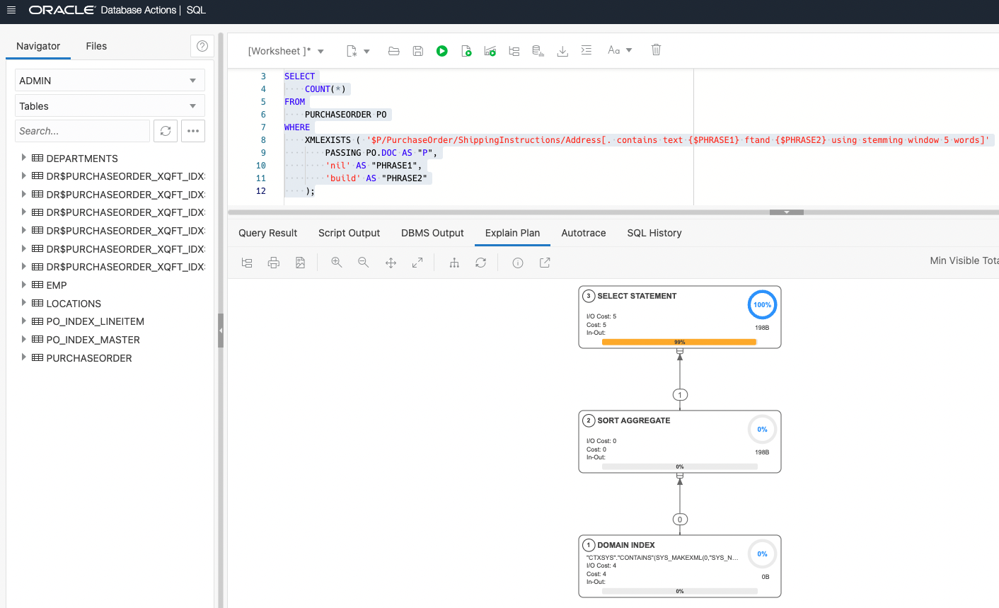

# Index XML data

## Introduction
Indexing XML data will give you quick access to the data and significantly improve the query performance. The use of indexes is particularly recommended for online transaction processing (OLTP) environments involving few updates.

Generally, when your XML data contains an island of structured, predictable data and your queries are known, we recommend using XMLIndex with a structured component. When you need to support ad-hoc XML queries, range, or text search queries, we recommend using the XML Search index. In this lab, we will explore both XMLIndex and XML Search Index.

Estimated Time: 45 minutes

### Objectives
In this lab, you will learn:
-	Using XMLIndex,
-	Using XML Search Index.

### Prerequisites
Be logged into your Oracle Cloud Account.

## Task 1: Open Database Actions
1. Log in to the Oracle Cloud.
2. If you are using a Free Trial or Always Free account, and you want to use Always Free Resources,  you need to be in a region where Always Free Resources are available. You can see your current default Region in the top, right-hand corner of the page.
3. Click the navigation menu in the upper left to show top-level navigation choices.
4. Click on Oracle Database and choose Autonomous Transaction Processing.
5. If using FreeTier, your compartment should be the root compartment for your tenancy.
Note: Avoid the use of the ManagedCompartmentforPaaS compartment as this is an Oracle default used for Oracle Platform Services.
6. You should see your database XMLDB listed in the center. Click on the database name "XMLDB".
7. On the database page, choose Database Actions.
8. You are now in Database Actions.
Database Actions allows you to connect to your Autonomous Database through various browser-based tools. We will just be using the SQL workshop tool.
9. You should be in the Database Actions panel. Click on the SQL card


## Task 2: Indexing XML data

### I1. Creating XMLIndex
Often times users know the structure or pattern of the queries. For example, consider the following few examples: 

```
<copy>
SELECT
    XMLQUERY('/PurchaseOrder/LineItems/LineItem/@ItemNumber'
        PASSING P.DOC
    RETURNING CONTENT).GETCLOBVAL()
FROM
    PURCHASEORDER P
WHERE
    XMLEXISTS ( '/PurchaseOrder[Reference="ROY-1PDT"]'
        PASSING P.DOC
    );
```
</copy>


```
<copy>
SELECT
    XMLQUERY('/PurchaseOrder/LineItems/LineItem/Part/text()'
        PASSING P.DOC
    RETURNING CONTENT).GETCLOBVAL()
FROM
    PURCHASEORDER P
WHERE
    XMLEXISTS ( '/PurchaseOrder[Reference="ROY-1PDT"]'
        PASSING P.DOC
    );
```
</copy>


All the queries use a similar pattern, and we can leverage that. Users can create an index focusing on those cases only. By doing that they will significantly reduce the index size and at the same time, we will get a significant performance improvement.

```
<copy>
DROP INDEX PURCHASEORDER_IDX;

BEGIN
    DBMS_XMLINDEX.DROPPARAMETER('PO_SXI_PARAMETERS');
END;
/
```
</copy>

Copy the above statement into the worksheet area and press "Run Statement".



 

```
<copy>
BEGIN
    DBMS_XMLINDEX.REGISTERPARAMETER('PO_SXI_PARAMETERS', 'GROUP   PO_LINEITEM
    	XMLTABLE PO_INDEX_MASTER ''/PurchaseOrder''
    	COLUMNS
       	REFERENCE        varchar2(30)   PATH ''Reference/text()'',
             LINEITEM            xmlType     PATH ''LineItems/LineItem''
       VIRTUAL XMLTABLE PO_INDEX_LINEITEM ''/LineItem''
       PASSING lineitem
      	COLUMNS
             ITEMNO         number(38)    PATH ''@ItemNumber'',
             UPC            varchar2(14)   PATH ''Part/text()'',     
             DESCRIPTION    varchar2(256)  PATH ''Part/@Description''
                    ');
END;
/
```
</copy>

Copy the above statement into the worksheet area and press "Run Statement".


 

Please grant the required privileges if needed.

```
<copy>
CREATE INDEX PURCHASEORDER_IDX ON
    PURCHASEORDER (
        DOC
    )
INDEXTYPE IS XDB.XMLINDEX PARAMETERS ( 'PARAM PO_SXI_PARAMETERS' );
```
</copy>

Copy the above statement into the worksheet area and press "Run Statement".



 

```
<copy>
-- we can even create a secondary index on primary index columns.
-- creating a secondary index on the REFERENCE column
CREATE UNIQUE INDEX REFERENCE_IDX ON
    PO_INDEX_MASTER (
        REFERENCE
    );

-- creating a secondary index on the UPC column
CREATE INDEX UPC_IDX ON
    PO_INDEX_LINEITEM (
        UPC
    );
```
</copy>

Copy the above statement into the worksheet area and press "Run Statement".


 


```
<copy>
SELECT
    XMLQUERY('/PurchaseOrder/LineItems/LineItem/@ItemNumber'
        PASSING P.DOC
    RETURNING CONTENT).GETCLOBVAL()
FROM
    PURCHASEORDER P
WHERE
    XMLEXISTS ( '/PurchaseOrder[Reference="ROY-1PDT"]'
        PASSING P.DOC
    );
```
</copy>

Copy the above statement into the worksheet area and press "Explain Plan".



 


```
<copy>
SELECT
    XMLQUERY('/PurchaseOrder/LineItems/LineItem/Part/text()'
        PASSING P.DOC
    RETURNING CONTENT).GETCLOBVAL()
FROM
    PURCHASEORDER P
WHERE
    XMLEXISTS ( '/PurchaseOrder[Reference="ROY-1PDT"]'
        PASSING P.DOC
    );
```
</copy>

Copy the above statement into the worksheet area and press "Explain Plan".


 

### I2. Creating XML Search Index
In the case of ad-hoc XML queries or queries requiring text search or range search, we recommend creating an XML Search index to get a performance boost.

```
<copy>
BEGIN
    CTX_DDL.DROP_PREFERENCE('STORAGE_PREFS');
END;
/

BEGIN
    CTX_DDL.DROP_SECTION_GROUP('XQFT');
END;
/

BEGIN
    CTX_DDL.CREATE_SECTION_GROUP('XQFT', 'PATH_SECTION_GROUP');
    CTX_DDL.SET_SEC_GRP_ATTR('XQFT', 'XML_ENABLE', 'T');
    CTX_DDL.CREATE_PREFERENCE('STORAGE_PREFS', 'BASIC_STORAGE');
END;
/
```
</copy>

Copy the above statement into the worksheet area and press "Run Statement".


 

```
<copy>
CREATE INDEX PURCHASEORDER_XQFT_IDX ON
    PURCHASEORDER (
        DOC
    )
INDEXTYPE IS CTXSYS.CONTEXT PARAMETERS ( 'storage STORAGE_PREFS 
            section group XQFT' );
```
</copy>

Copy the above statement into the worksheet area and press "Run Statement".


 

### SIQ1.
Finding addresses given a zipCode. After creating the search index, a query like this will significantly improve the query performance.

```
<copy>
SELECT
    COUNT(*)
FROM
    PURCHASEORDER PO
WHERE
    XMLEXISTS ( '(#ora:use_xmltext_idx #)
{$P/PurchaseOrder/LineItems/LineItem[@ItemNumber > $num]}'
        PASSING PO.DOC AS "P",
        '0' AS "num"
    );
```
</copy>

Copy the above statement into the worksheet area and press "Explain Plan".


 


### SIQ2.
Search for a contains match on a phrase. The contains match is case sensitive. 

```
<copy>
SELECT
    COUNT(*)
FROM
    PURCHASEORDER PO
WHERE
    XMLEXISTS ( ' (#ora:use_xmltext_idx #)
{$P/PurchaseOrder/ShippingInstructions/Address/street[contains(.,$PHRASE)]}'
        PASSING PO.DOC AS "P",
        'Building' AS "PHRASE"
    );
```
</copy>

Copy the above statement into the worksheet area and press "Explain Plan".



 

### SIQ3. 
An XQuery Full-Text "contains text" search on a phrase. The index is used since "contains text" comparisons are case insensitive. 

```
<copy>
SELECT
    COUNT(*)
FROM
    PURCHASEORDER PO
WHERE
    XMLEXISTS ( '(#ora:use_xmltext_idx #) {$P/PurchaseOrder/ShippingInstructions/Address/street[. contains text {$PHRASE}]}'
        PASSING PO.DOC AS "P",
        'building' AS "PHRASE"
    );
```
</copy>

Copy the above statement into the worksheet area and press "Explain Plan".


 

### SIQ4. 
An XQuery Full-Text "contains text" search on a phrase with stemming.

```
<copy>
SELECT
    COUNT(*)
FROM
    PURCHASEORDER PO
WHERE
    XMLEXISTS ( '$P/PurchaseOrder/ShippingInstructions/Address/street[. contains text {$PHRASE} using stemming]'
        PASSING PO.DOC AS "P",
        'build' AS "PHRASE"
    );
```
</copy>

Copy the above statement into the worksheet area and press "Explain Plan".


 

### SIQ5. 
An XQuery Full-Text "contains text" search on a fragment using the ftand operator. 

```
<copy>
SELECT
    COUNT(*)
FROM
    PURCHASEORDER PO
WHERE
    XMLEXISTS ( '$P/PurchaseOrder/ShippingInstructions/Address[. contains text {$PHRASE1} ftand {$PHRASE2} using stemming]'
        PASSING PO.DOC AS "P",
        'nil' AS "PHRASE1",
        'build' AS "PHRASE2"
    );
```
</copy>

Copy the above statement into the worksheet area and press "Explain Plan".


 

```
<copy>
SELECT
    COUNT(*)
FROM
    PURCHASEORDER PO
WHERE
    XMLEXISTS ( '$P/PurchaseOrder/ShippingInstructions/Address[. contains text {$PHRASE1} ftand {$PHRASE2} using stemming window 2 words]'
        PASSING PO.DOC AS "P",
        'nil' AS "PHRASE1",
        'build' AS "PHRASE2"
    );
```
</copy>

Copy the above statement into the worksheet area and press "Explain Plan".


 

```
<copy>
SELECT
    COUNT(*)
FROM
    PURCHASEORDER PO
WHERE
    XMLEXISTS ( '$P/PurchaseOrder/ShippingInstructions/Address[. contains text {$PHRASE1} ftand {$PHRASE2} using stemming window 5 words]'
        PASSING PO.DOC AS "P",
        'nil' AS "PHRASE1",
        'build' AS "PHRASE2"
    );
```
</copy>

Copy the above statement into the worksheet area and press "Explain Plan".


 
You may now **proceed to the next lab**.

## Learn More
- [Database 19c - JSON] (https://apexapps.oracle.com/pls/apex/r/dbpm/livelabs/view-workshop?wid=638)
- [Developing with JSON and SODA in Oracle Database] (https://apexapps.oracle.com/pls/apex/r/dbpm/livelabs/view-workshop?wid=831)
- [JSON without Limits] (https://apexapps.oracle.com/pls/apex/r/dbpm/livelabs/view-workshop?wid=836)
- [Using the Database API for MongoDB] (https://apexapps.oracle.com/pls/apex/r/dbpm/livelabs/view-workshop?wid=3152)
- [Database API for MongoDB - The Basics] (https://apexapps.oracle.com/pls/apex/r/dbpm/livelabs/view-workshop?wid=3221)
- [Full-Text Search in Oracle Database] (https://apexapps.oracle.com/pls/apex/r/dbpm/livelabs/view-workshop?wid=3286)
- [Autonomous Database Dedicated](https://apexapps.oracle.com/pls/apex/dbpm/r/livelabs/view-workshop?wid=677)
- [Manage and Monitor Autonomous Database](https://apexapps.oracle.com/pls/apex/dbpm/r/livelabs/view-workshop?wid=553)
- [Scaling and Performance in the Autonomous Database](https://apexapps.oracle.com/pls/apex/dbpm/r/livelabs/view-workshop?wid=608)


## Acknowledgements
* **Author** - Harichandan Roy, Principal Member of Technical Staff, Oracle Document DB
* **Contributors** -  XDB Team
* **Last Updated By/Date** - Harichandan Roy, February 2023
