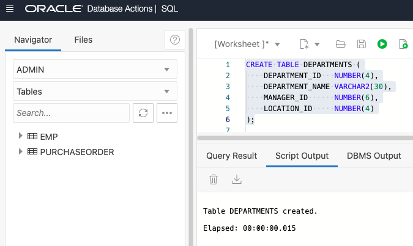
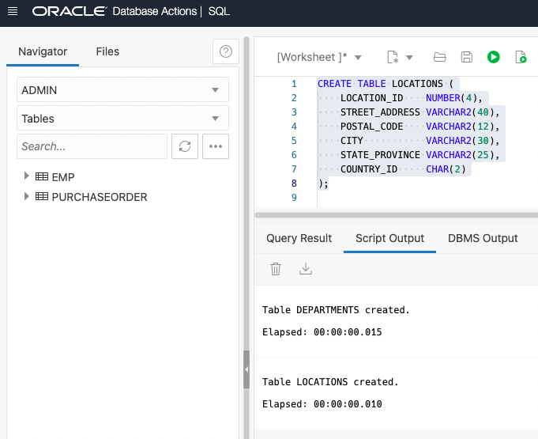
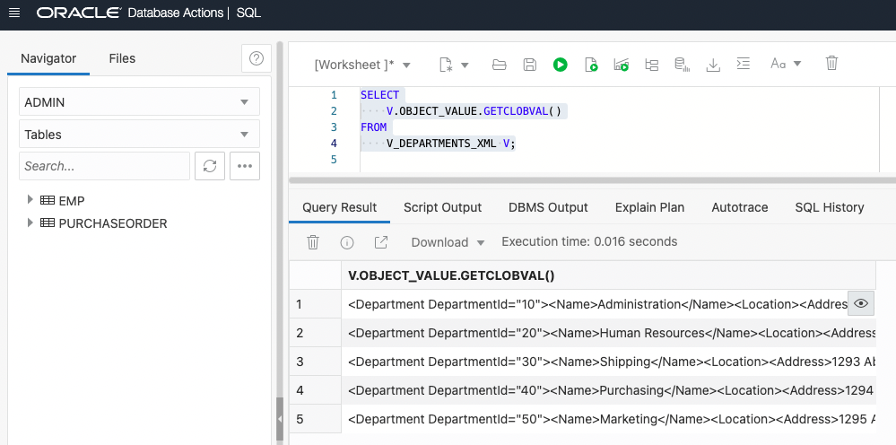
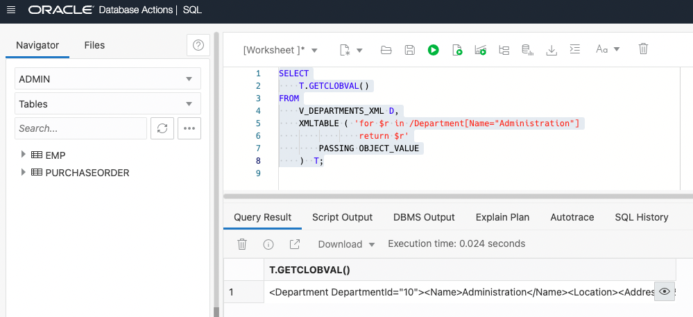
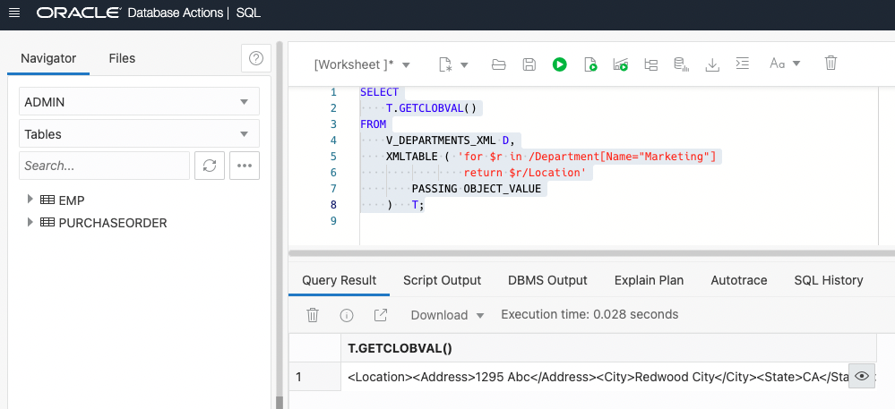

# Converting Relational Data to XML Data

## Introduction
Some applications expect XML data or in some contexts, we might need data in XML format. Let's assume that we have all the data that we need to feed to applications in relational tables. Oracle XML DB will help you generate XML data from relational tables.

Estimated Time: XYZ minutes

### Objectives
In this lab, you will learn:
-	Generating XML data from relational data

### Prerequisites
Be logged into your Oracle Cloud Account.

## Task 1: SQL/XML publishing functions
- XMLElement - Returns an XML value that is an XML element.
- XMLAttributes - Constructs XML attributes from the arguments. This function can be used only as an argument of the XMLELEMENT function.
- XMLForest - Returns an XML value that is a sequence of XML elements.
- XMLConcat - Returns a sequence containing the concatenation of a variable number of XML input arguments.
- XMLAgg - Returns an XML sequence containing an item for each non-null value in a set of XML values. 

## Task 2: Open Database Actions
1. Log in to the Oracle Cloud.
2. If you are using a Free Trial or Always Free account, and you want to use Always Free Resources,  you need to be in a region where Always Free Resources are available. You can see your current default Region in the top, right-hand corner of the page.
3. Click the navigation menu in the upper left to show top-level navigation choices.
4. Click on Oracle Database and choose Autonomous Transaction Processing.
5. If using FreeTier, your compartment should be the root compartment for your tenancy.
Note: Avoid the use of the ManagedCompartmentforPaaS compartment as this is an Oracle default used for Oracle Platform Services.
6. You should see your database XMLDB listed in the center. Click on the database name "XMLDB".
7. On the database page, choose Database Actions.
8. You are now in Database Actions.
Database Actions allows you to connect to your Autonomous Database through various browser-based tools. We will just be using the SQL workshop tool.
9. You should be in the Database Actions panel. Click on the SQL card

## Task 3: Creating XMLType views 
We have learned how to generate relational data from XML content in Lab 4. In this lab, we will do just the opposite. We will generate XML content from relational data. In many ways, it will be useful. Just for example, you can send data from relational tables as a response to an application’s request in XML format. Let’s see how to achieve that.

First, we will create two relational tables and then populate them with some sample data.

Table departments:
```
<copy>
CREATE TABLE DEPARTMENTS (
    DEPARTMENT_ID   NUMBER(4),
    DEPARTMENT_NAME VARCHAR2(30),
    MANAGER_ID      NUMBER(6),
    LOCATION_ID     NUMBER(4)
);
```
</copy>

Copy the above statement into the worksheet area and press "Run Statement".


 

Table locations:
```
<copy>
CREATE TABLE LOCATIONS (
    LOCATION_ID    NUMBER(4),
    STREET_ADDRESS VARCHAR2(40),
    POSTAL_CODE    VARCHAR2(12),
    CITY           VARCHAR2(30),
    STATE_PROVINCE VARCHAR2(25),
    COUNTRY_ID     CHAR(2)
);
```
</copy>

Copy the above statement into the worksheet area and press "Run Statement".




```
<copy>
insert into departments values (10, 'Administration', 200, 1100);
insert into departments values (20, 'Human Resources', 203, 1200);
insert into departments values (30, 'Shipping', 121, 1300);
insert into departments values (40, 'Purchasing', 114, 1400);
insert into departments values (50, 'Marketing', 201, 1500);

insert into locations values (1100, '1291 Abc', '94061', 'Redwood City', 'CA', 'US');
insert into locations values (1200, '1292 Abc', '94061', 'Redwood City', 'CA', 'US');
insert into locations values (1300, '1293 Abc', '94061', 'Redwood City', 'CA', 'US');
insert into locations values (1400, '1294 Abc', '94061', 'Redwood City', 'CA', 'US');
insert into locations values (1500, '1295 Abc', '94061', 'Redwood City', 'CA', 'US');

commit;
```
</copy>

Copy the above statement into the worksheet area and press "Run Statement".


 

### QXR1. Generating XML data
This query will transform relational data into XML data.

```
<copy>
SELECT
    XMLELEMENT(
        "Department",
        XMLATTRIBUTES(
            D.DEPARTMENT_ID AS "DepartmentId"
        ),
        XMLELEMENT(
            "Name",
            D.DEPARTMENT_NAME
        ),
        XMLELEMENT(
            "Location",
            XMLFOREST(STREET_ADDRESS AS "Address",
            CITY AS "City",
            STATE_PROVINCE AS "State",
            POSTAL_CODE AS "Zip",
            COUNTRY_ID AS "Country")
        )
    ).GETCLOBVAL()
FROM
    DEPARTMENTS D,
    LOCATIONS   L
WHERE
    D.LOCATION_ID = L.LOCATION_ID;
```
</copy>

Copy the above statement into the worksheet area and press "Run Statement".


 

### QXR2. Creating XMLType views
Now we will create a persistent XMLType view and then run XQuery over it.

```
<copy>
CREATE OR REPLACE VIEW V_DEPARTMENTS_XML OF XMLTYPE 
WITH OBJECT ID 
( 
    XMLCAST(XMLQUERY('/Department/Name' PASSING OBJECT_VALUE
    RETURNING CONTENT) AS VARCHAR2(30)) 
) 
AS
SELECT
    XMLELEMENT(
        "Department",
        XMLATTRIBUTES(
            D.DEPARTMENT_ID AS "DepartmentId"
        ),
        XMLELEMENT(
            "Name",
            D.DEPARTMENT_NAME
        ),
        XMLELEMENT(
            "Location",
            XMLFOREST(STREET_ADDRESS AS "Address",
            CITY AS "City",
            STATE_PROVINCE AS "State",
            POSTAL_CODE AS "Zip",
            COUNTRY_ID AS "Country"))
    )
FROM
    DEPARTMENTS D,
    LOCATIONS   L
WHERE
    D.LOCATION_ID = L.LOCATION_ID;
```
</copy>

Copy the above statement into the worksheet area and press "Run Statement".


 

```
<copy>
SELECT
    V.OBJECT_VALUE.GETCLOBVAL()
FROM
    V_DEPARTMENTS_XML V;

```
</copy>

Copy the above statement into the worksheet area and press "Run Statement".


 

### QXR3. Querying Over XMLType Views
    
Let's find a department named "Administration".

```
<copy>
SELECT
    T.GETCLOBVAL()
FROM
    V_DEPARTMENTS_XML D,
    XMLTABLE ( 'for $r in /Department[Name="Administration"]
                return $r'
        PASSING OBJECT_VALUE
    )  T;
```
</copy>

Copy the above statement into the worksheet area and press "Run Statement".



 

Or let’s find the location of the Marketing department.

```
<copy>
SELECT
    T.GETCLOBVAL()
FROM
    V_DEPARTMENTS_XML D,
    XMLTABLE ( 'for $r in /Department[Name="Marketing"]
                return $r/Location'
        PASSING OBJECT_VALUE
    )   T;
```
</copy>

Copy the above statement into the worksheet area and press "Run Statement".



 
## Learn More
- [Database 19c - JSON] (https://apexapps.oracle.com/pls/apex/r/dbpm/livelabs/view-workshop?wid=638)
- [Developing with JSON and SODA in Oracle Database] (https://apexapps.oracle.com/pls/apex/r/dbpm/livelabs/view-workshop?wid=831)
- [JSON without Limits] (https://apexapps.oracle.com/pls/apex/r/dbpm/livelabs/view-workshop?wid=836)
- [Using the Database API for MongoDB] (https://apexapps.oracle.com/pls/apex/r/dbpm/livelabs/view-workshop?wid=3152)
- [Database API for MongoDB - The Basics] (https://apexapps.oracle.com/pls/apex/r/dbpm/livelabs/view-workshop?wid=3221)
- [Full-Text Search in Oracle Database] (https://apexapps.oracle.com/pls/apex/r/dbpm/livelabs/view-workshop?wid=3286)
- [Autonomous Database Dedicated](https://apexapps.oracle.com/pls/apex/dbpm/r/livelabs/view-workshop?wid=677)
- [Manage and Monitor Autonomous Database](https://apexapps.oracle.com/pls/apex/dbpm/r/livelabs/view-workshop?wid=553)
- [Scaling and Performance in the Autonomous Database](https://apexapps.oracle.com/pls/apex/dbpm/r/livelabs/view-workshop?wid=608)


## Acknowledgements
* **Author** - Harichandan Roy, Principal Member of Technical Staff, Oracle Document DB
* **Contributors** -  XDB Team
* **Last Updated By/Date** - Harichandan Roy, February 2023
