# Update XML Content

## Introduction
This lab will use the SQL Workshop in Database Actions from the Autonomous Transaction Processing page. In this lab, we will explore XQuery to update XML content in Oracle XML DB. XQuery is one of the main ways that you interact with XML data in Oracle XML DB. It is the W3C language designed for querying and updating XML data. 

The support for the XQuery Language is provided through a native implementation of SQL/XML functions: XMLQuery, XMLTable, XMLExists, and XMLCast. These SQL/XML functions are defined by the SQL/XML standard as a general interface between the SQL and XQuery languages.

Estimated Time: XYZ minutes

### Objectives
In this lab, you will learn:
-	XQuery basics,
-	SQL/XML basics,
-	Updating an entire XML document,
-	Replacing XML nodes,
-	Inserting XML nodes,
-	Deleting XML nodes,
-	Creating XML Views of customized data

### Prerequisites
Be logged into your Oracle Cloud Account.

## Task 1: XQuery Basics

XQuery is the W3C language designed for querying and updating XML data. The core part of it is the XQuery expression. XQuery expressions are case-sensitive. An XQuery expression is either a simple expression or an updating expression, the latter being an expression that represents data modification. More precisely, these are the possible XQuery expressions:

-	Basic updating expression – an insert, delete, replace, or rename expression, or a call to an updating function.
-	Updating expression – a basic updating expression or an expression (other than a transform expression) that contains another updating expression (this is a recursive definition).
-	Simple expression – An XQuery 1.0 expression. It does not call for any updating.
Simple expressions include the following:
    - Primary expression – literal, variable, or function application. A variable name starts with a dollar sign ($) – for example, $foo. Literals include numerals, strings, and character or entity references.
    - XPath expression – Any XPath expression. The XPath 2.0 standard is a subset of XQuery.
    - FLWOR expression – The most important XQuery expression, composed of the following, in order, from which FLWOR takes its name: for, let, where, order by, and return.
    - XQuery sequence – The comma (,) constructor creates sequences. Sequence-manipulating functions such as union and intersect are also available. All XQuery sequences are effectively flat: a nested sequence is treated as its flattened equivalent. Thus, for instance, (1, 2, (3, 4, (5), 6), 7) is treated as (1, 2, 3, 4, 5, 6, 7). A singleton sequence, such as (42), acts the same in most XQuery contexts as does its single item, 42. Remember that the result of any XQuery expression is a sequence.
- And Conditional, Arithmetic, Relational expressions, and so on.

In this lab, we don’t intend to discuss XQuery in detail, please refer to the links below for more information about XQuery. 

The overview of XQuery language: [XQuery Overview] (https://docs.oracle.com/en/database/oracle/oracle-database/21/adxdb/xquery-and-XML-DB.html#GUID-927FB610-9553-4772-8D3E-FAA7546C4371)

The W3C XQuery link: [W3C Xquery] (https://www.w3.org/TR/xquery-31/)

## Task 2: SQL/XML Basics

SQL/XML functions, XMLQuery, XMLTable, XMLExists, and XMLCast, are defined by the SQL/XML standard as a general interface between SQL and XQuery languages. Using these functions, you can construct XML data using relational data, query relational data as if it were XML data, and construct relational data from XML data.

Here is a short overview of these SQL/XML functions:
-	XMLQuery - Use this function to construct or query XML data. It takes an XQuery expression as an argument and returns the result of evaluating the XQuery expression, as an XMLType instance. 

-	XMLTable - Use this function XMLTable to decompose the result of an XQuery-expression evaluation into the relational rows and columns of a new, virtual table. You can insert this data into a pre-existing database table, or you can query it using SQL — in a join expression, for example. 

-	XMLExists - Use this function to check whether a given XQuery expression returns a non-empty XQuery sequence. If so, the function returns TRUE. Otherwise, it returns FALSE. 

-	XMLCast - Use this function to cast an XQuery value to a SQL data type. 

Here is the link for more information: [XQL/XML functions] (https://docs.oracle.com/en/database/oracle/oracle-database/21/adxdb/xquery-and-XML-DB.html#GUID-4805CF1C-A00D-4B88-AF2E-00A9DB6F3392)

## Task 3: Open Database Actions

1. Log in to the Oracle Cloud.
2. If you are using a Free Trial or Always Free account, and you want to use Always Free Resources,  you need to be in a region where Always Free Resources are available. You can see your current default Region in the top, right-hand corner of the page.
3. Click the navigation menu in the upper left to show top-level navigation choices.
4. Click on Oracle Database and choose Autonomous Transaction Processing.
5. If using FreeTier, your compartment should be the root compartment for your tenancy.
Note: Avoid the use of the ManagedCompartmentforPaaS compartment as this is an Oracle default used for Oracle Platform Services.
6. You should see your database XMLDB listed in the center. Click on the database name "XMLDB".
7. On the database page, choose Database Actions.
8. You are now in Database Actions.
Database Actions allows you to connect to your Autonomous Database through various browser-based tools. We will just be using the SQL workshop tool.
9. You should be in the Database Actions panel. Click on the SQL card

## Task 4: Updating XML Content

### UQ1. Updating an entire XML document
We can simply use the standard SQL update statement to update an entire XML document.

Let’s check the content before issuing an updated statement.

```
<copy>
SELECT
    P.DOC.GETCLOBVAL()
FROM
    PURCHASEORDER P
WHERE
    P.ID = 1;
```
</copy>

Copy the above statement into the worksheet area and press "Run Statement".

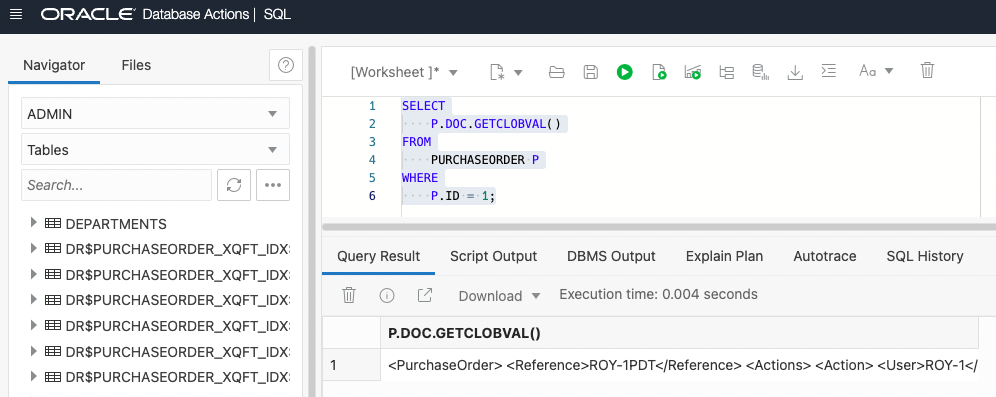

 

Then, run the following SQL update statement to update an entire XML document.

```
<copy>
UPDATE PURCHASEORDER P
SET
    P.DOC = XMLTYPE('<doc>updated doc</doc>')
WHERE
    P.ID = 1;
```
</copy>

Copy the above statement into the worksheet area and press "Run Statement".

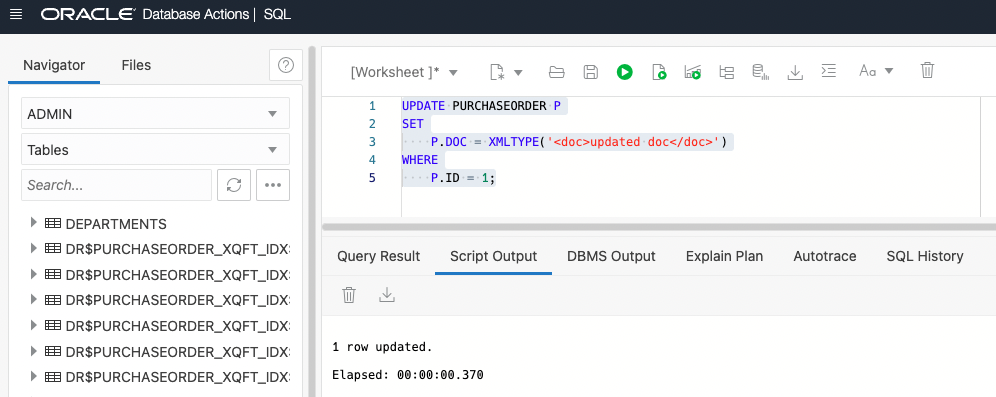

 

Now let’s check the updated content.

```
<copy>
SELECT
    P.DOC.GETCLOBVAL()
FROM
    PURCHASEORDER P
WHERE
    P.ID = 1;
```
</copy>

Copy the above statement into the worksheet area and press "Run Statement".


You should see the updated XML doc for id 1.

 

Now roll back to the previous content.

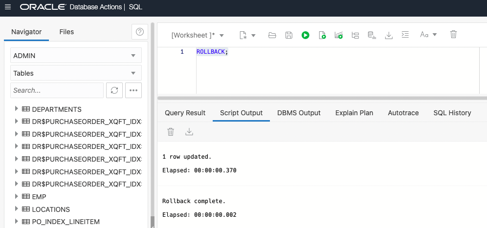

 

### UQ2. Replacing XML nodes
In the previous example, we replaced the entire document. However, in most practical scenarios we just need to modify a part of the document. To do that, we can use XQuery update with a SQL update statement.

In the following example, we will update the Requestor info in the XML document with the Reference value as 'ROY-3PDT'. 

First, let's see the current value of the Requestor node.

```
<copy>
SELECT
    XMLQUERY('$p/PurchaseOrder/Requestor/text()'
        PASSING PO.DOC AS "p"
    RETURNING CONTENT).GETCLOBVAL() REQUESTOR
FROM
    PURCHASEORDER PO
WHERE
    XMLEXISTS ( '$p/PurchaseOrder[Reference="ROY-3PDT"]'
        PASSING PO.DOC AS "p"
    );
```
</copy>

Copy the above statement into the worksheet area and press "Run Statement".

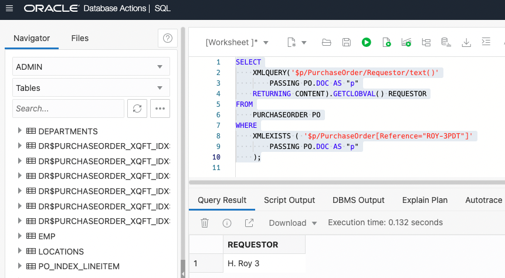

 

Now we pass the new value 'XDB Team' as a variable $p2 to the XQuery expression and evaluate the expression for the documents having Reference value as 'ROY-3PDT'.

```
<copy>
UPDATE PURCHASEORDER PO
SET
    PO.DOC = XMLQUERY('copy $i := $p1 modify
                (for $j in $i/PurchaseOrder/Requestor
                return replace value of node $j with $p2)
                return $i'
        PASSING PO.DOC AS "p1",
        'XDB Team' AS "p2"
    RETURNING CONTENT)
WHERE
    XMLEXISTS ( '$p/PurchaseOrder[Reference="ROY-3PDT"]'
        PASSING PO.DOC AS "p"
    );
```
</copy>

Copy the above statement into the worksheet area and press "Run Statement".

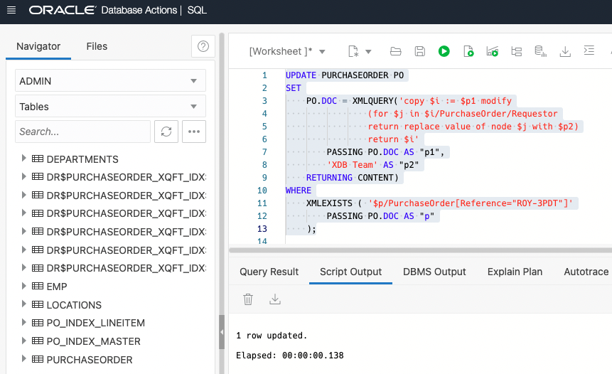

 

Now let’s see the updated content.

```
<copy>
SELECT
    XMLQUERY('$p/PurchaseOrder/Requestor/text()'
        PASSING PO.DOC AS "p"
    RETURNING CONTENT).GETCLOBVAL() REQUESTOR
FROM
    PURCHASEORDER PO
WHERE
    XMLEXISTS ( '$p/PurchaseOrder[Reference="ROY-3PDT"]'
        PASSING PO.DOC AS "p"
    );

ROLLBACK;
```
</copy>

Copy the above statement into the worksheet area and press "Run Statement".

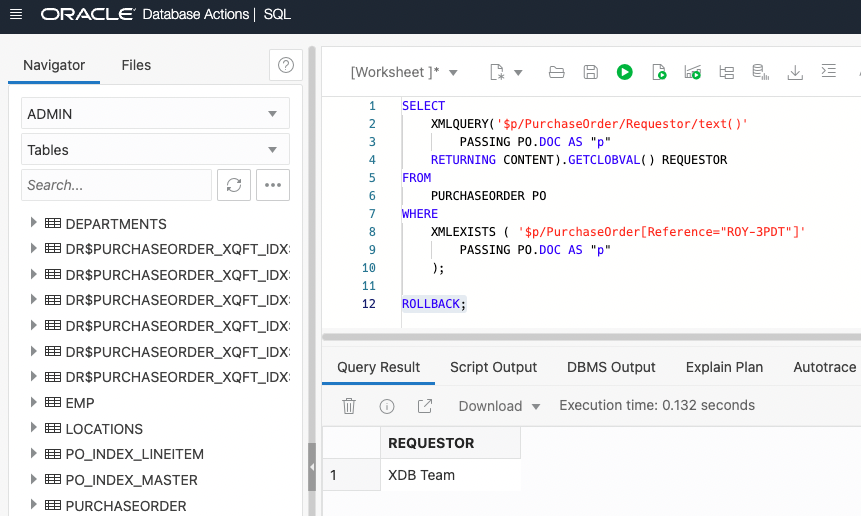

 

### UQ3. Inserting XML nodes
The user may want to add a new XML node to an XML document. This example inserts a new LineItem element as a child of the element LineItems. 

Before inserting a new XML node, let’s check the current content using this query:

```
<copy>
SELECT
    XMLQUERY('$p/PurchaseOrder/LineItems/LineItem[@ItemNumber=5]'
        PASSING PO.DOC AS "p"
    RETURNING CONTENT).GETCLOBVAL() ITEM
FROM
    PURCHASEORDER PO
WHERE
    XMLEXISTS ( '$p/PurchaseOrder[Reference="ROY-3PDT"]'
        PASSING PO.DOC AS "p"
    );
```
</copy>

Copy the above statement into the worksheet area and press "Run Statement".

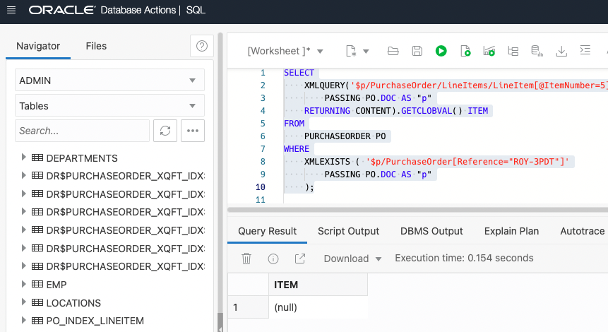

 

Now we will use the XQuery update statement to insert a new XML node into the document. The following query is inserting a new XML node LineItem with ItemNumber = 5 into an XML document having "ROY-3PDT" as its Reference value.

```
<copy>
UPDATE PURCHASEORDER PO
SET
    PO.DOC = XMLQUERY('copy $i := $p1 modify
                    (for $j in $i/PurchaseOrder/LineItems
                    return (# ora:child-element-name LineItem #)
                            {insert node $p2 into $j})
                    return $i'
        PASSING PO.DOC AS "p1",
        XMLTYPE('<LineItem ItemNumber="5">
                                    <Part Description="Keyboard" UnitPrice="100">1</Part>
                                    <Quantity>1</Quantity>
                                </LineItem>') AS "p2"
    RETURNING CONTENT)
WHERE
    XMLEXISTS ( '$p/PurchaseOrder[Reference="ROY-3PDT"]'
        PASSING PO.DOC AS "p"
    );
```
</copy>

Copy the above statement into the worksheet area and press "Run Statement".

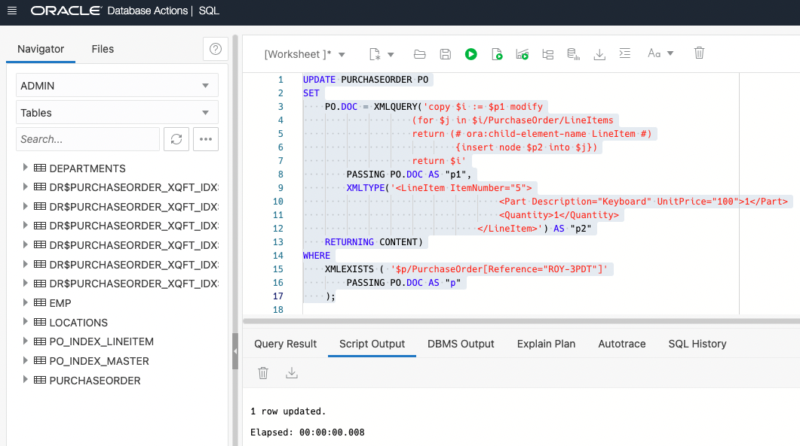

 

Whether the new XML node was inserted or not, let’s run this query and see if it’s there:

```
<copy>
SELECT
    XMLQUERY('$p/PurchaseOrder/LineItems/LineItem[@ItemNumber=5]'
        PASSING PO.DOC AS "p"
    RETURNING CONTENT).GETCLOBVAL() ITEM
FROM
    PURCHASEORDER PO
WHERE
    XMLEXISTS ( '$p/PurchaseOrder[Reference="ROY-3PDT"]'
        PASSING PO.DOC AS "p"
    );
```
</copy>

Copy the above statement into the worksheet area and press "Run Statement".


 

### UQ4. Deleting XML nodes
In this example, we will use an XQuery update statement to delete an XML node, LineItem with ItemNumber = 5 from the XML documents having "ROY-3PDT" as the Reference value.

Let’s first check the current content in the document:

```
<copy>
SELECT
    XMLQUERY('$p/PurchaseOrder/LineItems/LineItem[@ItemNumber=5]'
        PASSING PO.DOC AS "p"
    RETURNING CONTENT).GETCLOBVAL() ITEM
FROM
    PURCHASEORDER PO
WHERE
    XMLEXISTS ( '$p/PurchaseOrder[Reference="ROY-3PDT"]'
        PASSING PO.DOC AS "p"
    );
```
</copy>

Copy the above statement into the worksheet area and press "Run Statement".


 

Then run the following update statement to delete the XML node:

```
<copy>
UPDATE PURCHASEORDER PO
SET
    PO.DOC = XMLQUERY('copy $i := $p modify
                    delete nodes $i/PurchaseOrder/LineItems/LineItem[@ItemNumber="5"]
                    return $i'
        PASSING PO.DOC AS "p"
    RETURNING CONTENT)
WHERE
    XMLEXISTS ( '$p/PurchaseOrder[Reference="ROY-3PDT"]'
        PASSING PO.DOC AS "p"
    );
```
</copy>

Copy the above statement into the worksheet area and press "Run Statement".

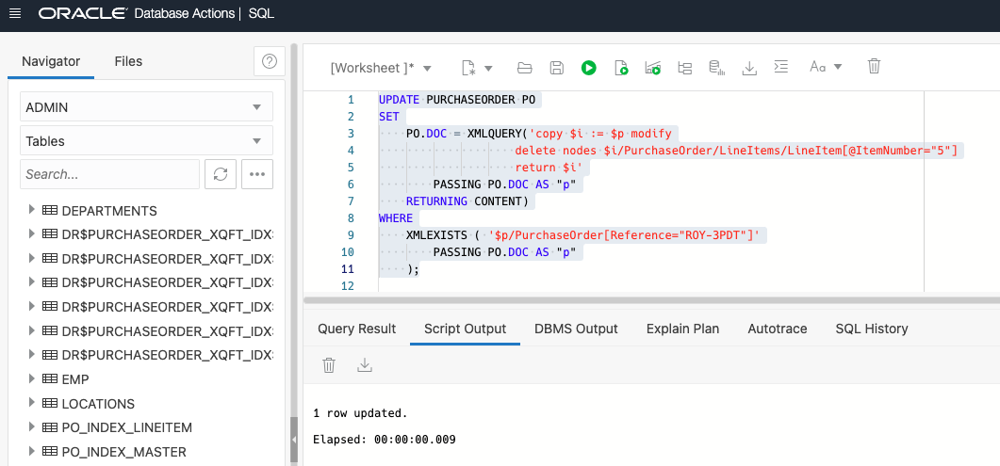

 

Now let’s check the updated content of the documents.

```
<copy>
SELECT
    XMLQUERY('$p/PurchaseOrder/LineItems/LineItem[@ItemNumber=5]'
        PASSING PO.DOC AS "p"
    RETURNING CONTENT).GETCLOBVAL() ITEM
FROM
    PURCHASEORDER PO
WHERE
    XMLEXISTS ( '$p/PurchaseOrder[Reference="ROY-3PDT"]'
        PASSING PO.DOC AS "p"
    );
```
</copy>

Copy the above statement into the worksheet area and press "Run Statement".

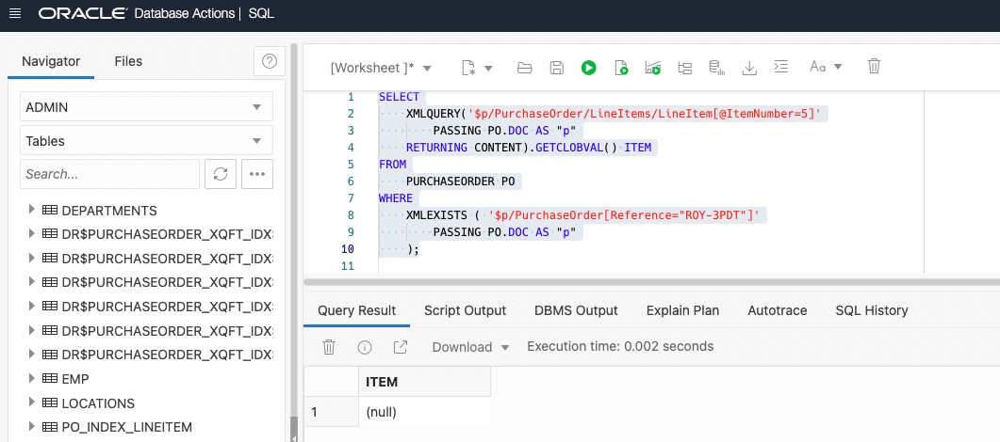

 

### UQ5. Creating an XML View of customized data
Sometimes the size of the XML document is very big, or it may have some information that users are not interested in or maybe some confidentiality or other reasons, the users may want to see some customized or synthesized or even null data in some fields of the documents. In this example, we will show you how to achieve that. This query nullifies some of its content.

```
<copy>
SELECT
    XMLQUERY('copy $i := $p1 modify
                        ((for $j in $i/PurchaseOrder/Actions
                        return replace value of node $j with ()),
                        (for $j in $i/PurchaseOrder/ShippingInstructions
                        return replace value of node $j with ()),
                        (for $j in $i/PurchaseOrder/LineItems
                        return replace value of node $j with ()))
                    return $i'
        PASSING PO.DOC AS "p1"
    RETURNING CONTENT).GETCLOBVAL() RESPONSE
FROM
    PURCHASEORDER PO
WHERE
    PO.ID = 2;
```
</copy>

Copy the above statement into the worksheet area and press "Run Statement".

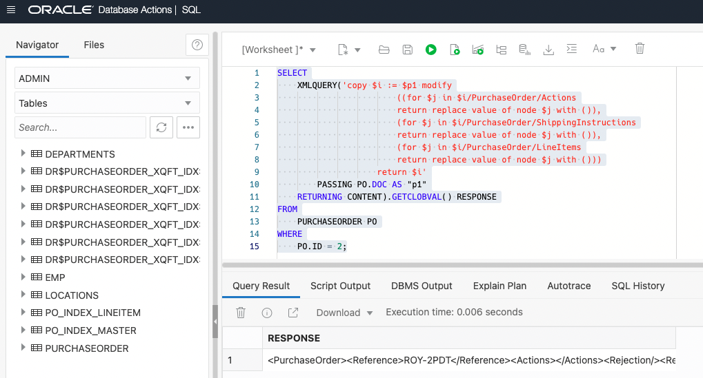

 

Now let’s create a view on this.

```
<copy>
CREATE OR REPLACE VIEW V_PO_SUMMARY OF XMLTYPE 
WITH OBJECT ID 
( 
    XMLCAST(XMLQUERY('/PurchaseOrder/Reference' PASSING OBJECT_VALUE
    RETURNING CONTENT) AS VARCHAR2(30)) 
) 
AS
SELECT
    XMLQUERY('copy $i := $p1 modify
                        ((for $j in $i/PurchaseOrder/Actions
                        return replace value of node $j with ()),
                        (for $j in $i/PurchaseOrder/ShippingInstructions
                        return replace value of node $j with ()),
                        (for $j in $i/PurchaseOrder/LineItems
                        return replace value of node $j with ()))
                    return $i'
        PASSING PO.DOC AS "p1"
    RETURNING CONTENT)
FROM
    PURCHASEORDER PO
WHERE
    PO.ID = 2;
```
</copy>

Copy the above statement into the worksheet area and press "Run Statement".

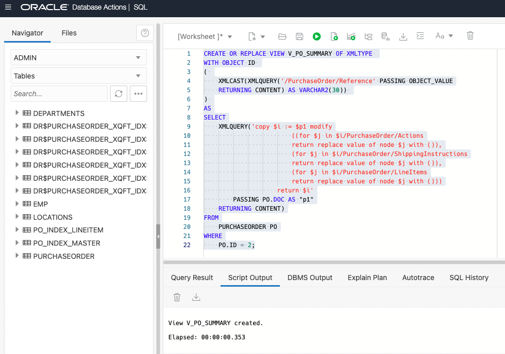

 

```
<copy>
SELECT
    T.OBJECT_VALUE.GETCLOBVAL()
FROM
    V_PO_SUMMARY T;
```
</copy>

Copy the above statement into the worksheet area and press "Run Statement".

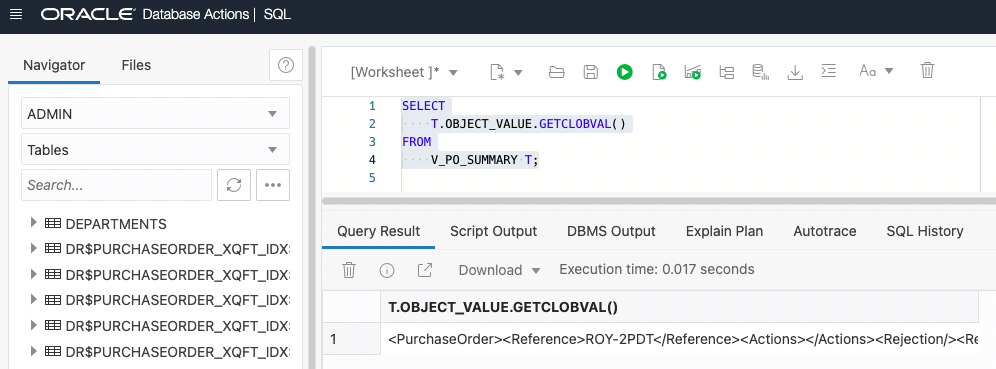

 
## Learn More
- [Database 19c - JSON] (https://apexapps.oracle.com/pls/apex/r/dbpm/livelabs/view-workshop?wid=638)
- [Developing with JSON and SODA in Oracle Database] (https://apexapps.oracle.com/pls/apex/r/dbpm/livelabs/view-workshop?wid=831)
- [JSON without Limits] (https://apexapps.oracle.com/pls/apex/r/dbpm/livelabs/view-workshop?wid=836)
- [Using the Database API for MongoDB] (https://apexapps.oracle.com/pls/apex/r/dbpm/livelabs/view-workshop?wid=3152)
- [Database API for MongoDB - The Basics] (https://apexapps.oracle.com/pls/apex/r/dbpm/livelabs/view-workshop?wid=3221)
- [Full-Text Search in Oracle Database] (https://apexapps.oracle.com/pls/apex/r/dbpm/livelabs/view-workshop?wid=3286)
- [Autonomous Database Dedicated](https://apexapps.oracle.com/pls/apex/dbpm/r/livelabs/view-workshop?wid=677)
- [Manage and Monitor Autonomous Database](https://apexapps.oracle.com/pls/apex/dbpm/r/livelabs/view-workshop?wid=553)
- [Scaling and Performance in the Autonomous Database](https://apexapps.oracle.com/pls/apex/dbpm/r/livelabs/view-workshop?wid=608)


## Acknowledgements
* **Author** - Harichandan Roy, Principal Member of Technical Staff, Oracle Document DB
* **Contributors** -  XDB Team
* **Last Updated By/Date** - Harichandan Roy, February 2023
